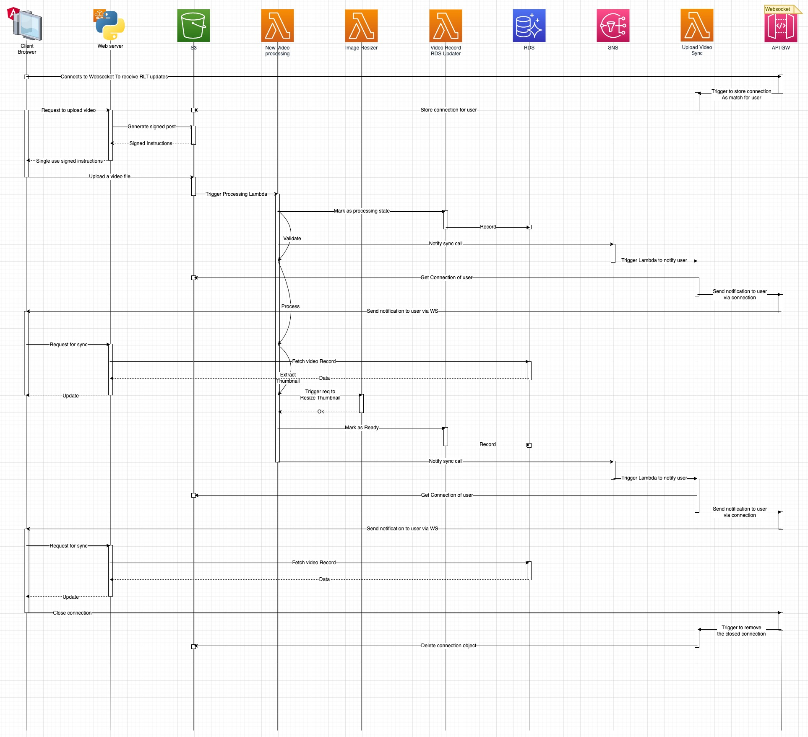
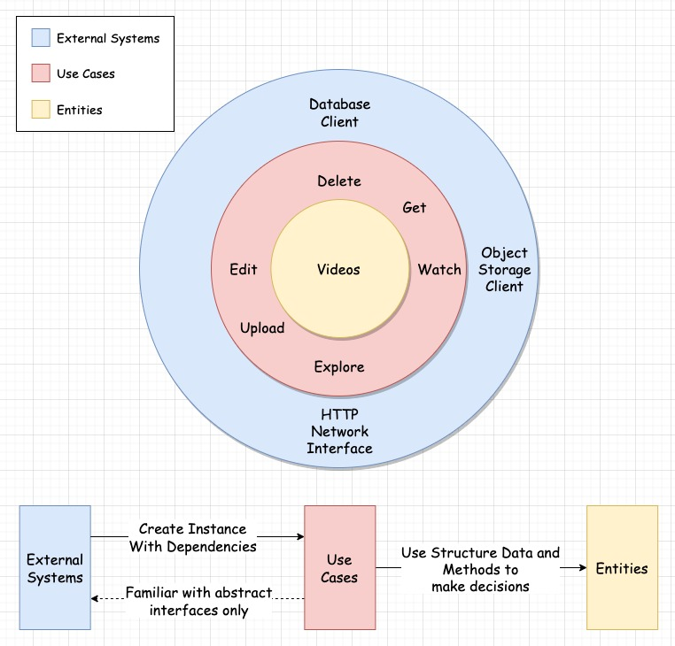

<hr>

AWS based solution of simple video drive.

Part of a CS degree course <strong>(EASS)</strong> final project.

You can find more of this course porjects <a href="https://github.com/EASS-HIT-PART-A-2022-CLASS-II">here.</a>

## Features:

The user functionalities which are currently supported include:

:soon: &nbsp; Create Users

:gem: &nbsp; Upload / Delete your videos.

:gem: &nbsp; Control whether your videos are private or public so others can watch them.

:gem: &nbsp; Watch yours / others public videos.

:gem: &nbsp; Explore videos of other users.


## Status:

:soon: &nbsp; MVP

Quick demonstration of video upload using with GUI and edits video & watch it using api via postman, until UI support those.


https://user-images.githubusercontent.com/39523779/207732011-dc837ec9-5b41-423e-a0e0-6d5acb9b2a3c.mp4


## Design:

### High Level Diagram


### Video Upload Use Case Sequence Diagram

This diagram is intended to show the relationship between the system components in the case of system-wide usage.

> Note: In order to better understand the diagram below, the async operations are synchronized.
>
> As a result, the time intervals on the diagram are out of true proportions.



### API Web Server Service Diagram

To read more about the API Web Server Design, <strong>[click here](./services/api/)</strong> the service directory will open with the readme file just below the source code.




## How To Use

### Prerequisites

#### :point_right: &nbsp; Ensure the following are installed:

- <b>Docker</b> - is needed to build images.

    https://www.docker.com/

- <b>Terraform</b> - is being used for provisioning.

    https://registry.terraform.io/

- <b>AWS CLI</b> - is required for RDS Schema creation as part of deployment.

    https://aws.amazon.com/cli/

#### :point_right: &nbsp; Ensure the following are already exist:

- <b>AWS Account</b> - deployment is going to request for cloud resources from AWS and therefore, an account is required.

    https://aws.amazon.com/

- <b>AWS Route53 Hosted zone /w Domain</b> - deployment step includes:
  - Certificate creation for Cloudfront and domain for frontend.
  - Certificate creation for HTTPS connection to the Web server's Load balancer.

  Thus, to create & validate this certificate automatically, first, a valid domain should be registered.

    Route53 Domain registration step-by-step guide (zone will be created automatically):

    https://docs.aws.amazon.com/Route53/latest/DeveloperGuide/domain-register.html

## Deployment

First, navigate to the deployment directory:

```bash
# from root directory
foo@bar:~ (root) $ cd deployment
```

Run:

```bash
# will download necessary plugins
foo@bar:~ (deployment) $ terraform init
```

Next, from the deployment directory, to deploy:

> Make sure the length of your app name does not exceed 18 bytes, as it is used as an identifier in some resources that restrict the length of their identifier.

```bash
# During future deployments of an existing cluster,
# You can use the db_mode patch (or none),
# And fill the dll file with the relevant SQL commands.
foo@bar:~ (deployment) $ ./terraform.sh --command apply \
--aws_access_key <AWS_ACCESS_KEY> \
--aws_secret_key <AWS_SECRET_KEY> \
--app_name <APP_NAME> \
--domain <REGISTERED ROUTE53 DOMAIN> \
--db_mode init
```

> ### Note: Provision of resources on AWS with this command can result in invoicing.

## Next Milestones

&nbsp;&nbsp; :rock: &nbsp; Web Server service simplicity: Add G.C Service, for atomic delete operation (S3, RDS)

&nbsp;&nbsp; :rock: &nbsp; Cost: Split New video processing Lambda to smaller compute functions (and big one ONLY for the ffmpeg step, which is the most expensive one) while calling the smaller specific functions in parallel

&nbsp;&nbsp; :rock: &nbsp; Robustness: Add System-Wide test suite for B.B "Result" tests

&nbsp;&nbsp; :rock: &nbsp; Upload Performance: Enable S3 transfer acceleration

&nbsp;&nbsp; :rock: &nbsp; Streaming Performance: Use CloudFront to stream videos instead of S3 directly, for caching

&nbsp;&nbsp; :rock: &nbsp; Security and Scale: Users & Authentication based on JWT

&nbsp;&nbsp; :rock: &nbsp; Security: Add some shared Auth logic to API Web Server and WSS Server to validate JWT so the GUI cannot send invalid requests to either of them

&nbsp;&nbsp; :rock: &nbsp; Processing: Add Celery/Some Pipeline processing of new videos for multi-resolution support

&nbsp;&nbsp; :rock: &nbsp; Processing: Extract N video frames for videos thumbnails to appear on video hover (on GUI)

&nbsp;&nbsp; :rock: &nbsp; Dev Experience: Add some Jump host on EC2 (access using ssh), with access to private RDS


## Contact

Project owner:
> <a href="https://github.com/chapost1"><kbd></kbd></a> &nbsp; Shahar Tal
>
> [Github](https://github.com/chapost1) | [LinkedIn](https://www.linkedin.com/in/shahar-tal-4aa887166/) 
