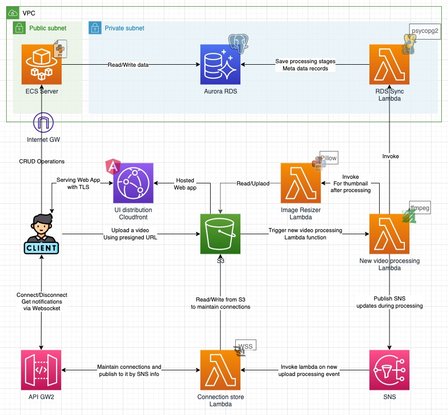

<hr>

AWS based solution of simple video drive.

Part of a CS degree course <strong>(EASS)</strong> final project.

## Design:



## Prerequisites
<hr>

### Ensure the following are installed:

- <b>Docker</b> - is needed to build images.

    https://www.docker.com/

- <b>Terraform</b> - is being used for provisioning.

    https://registry.terraform.io/

- <b>AWS CLI</b> - is required for RDS Schema creation as part of deployment.

    https://aws.amazon.com/cli/

<br>

### Ensure the following are already exist:

- <b>AWS Account</b> - deployment is going to request for cloud resources from AWS and therefore, an account is required.

    https://aws.amazon.com/

- <b>AWS Route53 Domain</b> - deployment step is going to provision an https loadbalancer which will rely on certificate, thus to create & approve this certificate automatically, first, a valid domain should be registered.

    Route53 Domain registration step-by-step guide:

    https://docs.aws.amazon.com/Route53/latest/DeveloperGuide/domain-register.html

## Deployment
<hr>

First, navigate to the deployment directory and run:

```bash
# will download necessary plugins
foo@bar:~ (main) $ terraform init
```

Next, from the root directory, to deploy:

> Make sure the length of your app name does not exceed 18 bytes, as it is used as an identifier in some resources that restrict the length of their identifier.

```bash
# During future deployments of an existing cluster,
# You can use the db_mode patch (or none),
# And fill the dll file with the relevant SQL commands.
foo@bar:~ (main) $ ./deployment/terraform.sh --command apply \
--aws_access_key <AWS_ACCESS_KEY> \
--aws_secret_key <AWS_SECRET_KEY> \
--app_name <APP_NAME> \
--domain <REGISTERED ROUTE53 DOMAIN> \
--db_mode init
```

> ### Note: Provision of resources on AWS with this command can result in invoicing.
